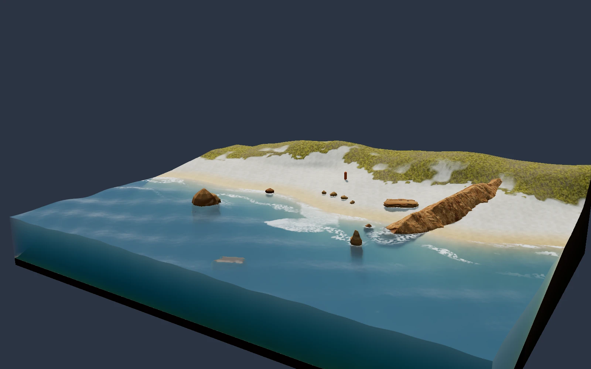
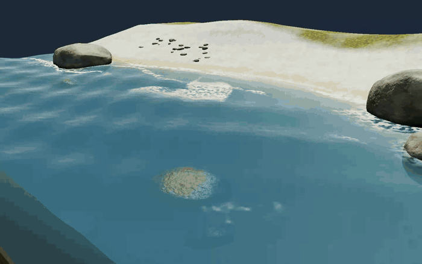

# Ocean Shader Lab



An interactive coastal diorama running in the browser: translucent blue water, a visible seabed, moving shoreline foam, warm fractured rocks, sand and vegetation. Front and side cutaway faces reveal the water volume. The scene is an original implementation in Three.js, TypeScript and GLSL, initially inspired by Marco Ludovico Perego’s coastal diorama. The reference image and its source code are not distributed.

## Development preview — Living Cove

This six-second GIF is a camera tour recorded from a rendered development scene (700×438, approximately 2.8 MB). It shows the new cove and geological cutaway work and differs from the current live release. The turtle and upcoming game features are not included in this preview.



## Run locally

This version was checked with Node 26.7.0 and npm 11.19.0. Use a supported even-numbered Node release >=22.12 and keep `package-lock.json`.

```sh
npm ci
npm run dev
```

The local address is http://127.0.0.1:4173. Validation commands:

```sh
npm run check
npm test
npm run test:e2e
npm run build
```

Browser tests use a separate Chromium instance. If required, run `npx playwright install chromium` once. On October 4, 2026, checkpoint 74 passed TypeScript, 17 unit tests, 17 browser tests and the build for the preserved scene. Content update 75 passed TypeScript and the build; eight of 17 unit tests passed, while nine geometry-building tests hit the existing five-second timeout. A repeat with one worker and the same deadline produced the same nine timeouts. Of the two relevant fallback browser tests, prompt navigation passed; the WebGL-absence test timed out during dev-server navigation at 15 seconds. The 16-core host had a load average of 141.5 and later 202.3. Source hashes were unchanged. These results are not presented as a new successful full test run. New production assets are checked separately through direct HTTP and fallback loading. `npm ci` was not repeated for that content update; a fresh installation is not claimed for that run.

Installed stack: Three.js 0.186.1, @types/three 0.186.0, Vite 8.3.2, TypeScript 7.0.2, Vitest 5.0.3 and Playwright 1.63.0. The application uses no React, backend, database or paid generation API.

## Explore the scene

Drag to orbit and scroll to zoom. Play/Pause controls wave motion. Coast settings provides wave swell from 0 to 1, water level from −0.35 to +0.35, sun direction from 0 to 360°, Auto/Low/Balanced/High quality and a camera reset. If fullscreen is rejected, a link lets you open a standalone view.

Reduced motion starts the scene still. Enabling that preference while the application is open pauses motion; you can explicitly resume with Play. Turning the preference off does not resume a scene you manually paused. Time and the animation loop stop in a hidden tab. WebGL2 is required. If it is unavailable, a shader fails or the graphics context is lost, the fallback shows a poster rendered from this scene, a prompt link and Retry.

## Reproduce the project

[PROMPT.md](./PROMPT.md) contains the full reproduction prompt, technical scene details, iterative refinement prompts, visual acceptance checks and ideas for later versions. The same UTF-8 file is copied byte for byte into the build; publication checks verify the match and its SHA-256 hash. The instructions can help produce a similar result, but do not guarantee an identical image in one attempt or pixel-perfect output across GPUs.

The current scene uses seed 7. It shares a 129×129 height/rock-mask grid across a 32×24 terrain and water area, CPU/shader bilinear height sampling, a cutaway top edge aligned with the waves and a lower edge grounded on the real seabed. The perspective camera has a 34.73° field of view and target [0,2.22,1.48]; its default desktop position is [20.85,12,32.64]. Portrait framing scales around the same target. The cutaway water shader uses a visual absorption/scattering approximation. Rock surfaces are procedural. The older spherical rock layout and an open coastline without cutaway faces are not the scene described by this version.

## Rendering and performance

The static coast is captured into linear color and depth targets. The cache is refreshed when the camera, lighting, tide, quality or buffer size changes; ordinary wave animation does not redraw the entire terrain and every rock each frame. The water surface, cutaway and optical resources share one water factory. The application uses one animation loop and idempotent disposal. Auto lowers quality after three seconds of sustained slow rendering and does not override manual quality. DPR caps for Low/Balanced/High are 1/1.5/2. The targets are 60 desktop FPS and 30 FPS on small screens; they are goals, not guarantees.

Measurements differed and have not been combined:

| Measurement | Environment and conditions | Desktop | Mobile-sized viewport |
|---|---|---:|---:|
| Historical checkpoint 63 | Apple M3 Max, ANGLE Metal, headed Chromium 153.0.8010.12; 3.4 s warmup and 10 s sample, Auto/Balanced | 1440×900, DPR 1: 60.0 rendered FPS; p95 17.9 ms | 390×844, DPR 2: 30.0 rendered FPS; p95 40.1 ms |
| Current preserved scene, checkpoint 74 | Same reported Mac/GPU/browser; 3.4 s warmup and 10 s sample, Auto switched to Low during measurement | 1440×900, DPR 1: 30.0 rendered FPS; p95 34.8 ms | 390×844, DPR 2: 22.6 rendered FPS; p95 66.9 ms |

FPS was measured from renders actually submitted to the default framebuffer, rather than callback counts. Measurement windows included no video recording or canvas readback. The current mobile viewport’s final drawing buffer was 390×844 on Low. An additional five-second headed desktop diagnostic measured the visible, focused page’s raw requestAnimationFrame cadence at approximately 30 callbacks per second. An environment equivalent to the earlier 60 FPS run was not confirmed; the cause of the difference was not established or attributed solely to shader cost. CPU submission time is not GPU execution time.

The mobile viewport represents a small-screen/touch workload on the actual Mac, not a physical phone test. Earlier SwiftShader results are separate software-GPU measurements and are not combined with Metal measurements into a performance promise. New features need before/after measurements under the same conditions.

## Embedding and publication scope

`wrangler.jsonc` is configured to upload only the static assets in `dist`. There is no Worker code, server, database or secret. HTTP `_headers` limits framing to https://portfolio.muum.ai. The local development parent uses port 4321; that origin is removed from production JavaScript. Messages are validated by origin, source window, channel, version and payload. Renderer resources are released when the scene closes.

The build allowlist accepts only index.html, the scene’s own poster.webp, the complete PROMPT.md, _headers and generated JS/CSS assets. Environment files, credentials, private evidence and designs, the original reference image, source maps and older portfolio projects are excluded. A successful local build does not mean an external deployment has occurred. The earlier scene update documented here did not include a commit, push or deployment. README media is a separate documentation update and does not publish the developing game code.

## Limits and future work

Waves, foam, caustics, refraction and cutaway absorption are visual approximations. There is no hydrodynamic solver, physical fluid collision or ray-traced renderer. This is procedural CGI and does not claim photographic realism. Screen-space refraction and the finite cutaway volume have view-dependent limits. Test counts are not evidence of visual quality.

Living Cove is progressing as a separate development effort: an original Aegean coast with a small pebble beach, a fish shoal, seagrass, marine-life density, time of day and sea state. These are not working features of the current Ocean release. The picnic family is reserved for a later phase.
