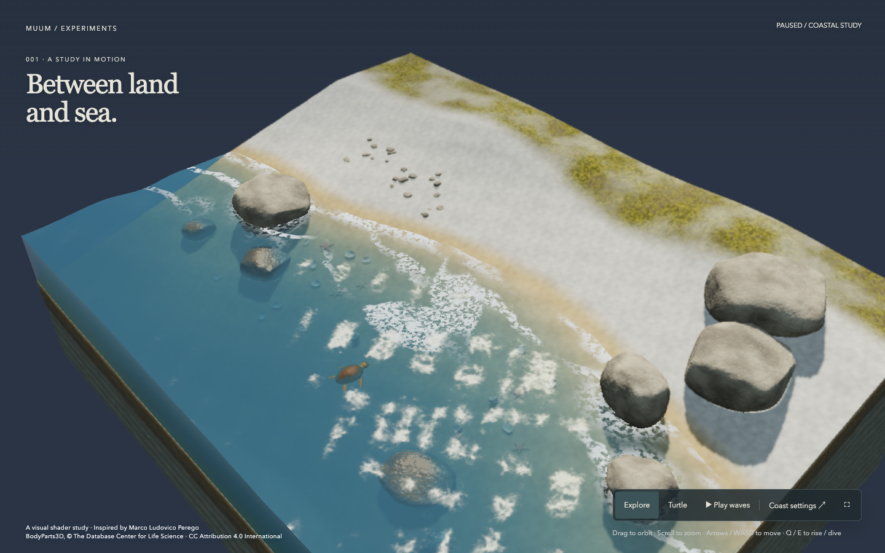

# Ocean Shader Lab



An interactive coastal diorama running in the browser: translucent blue water, shoreline foam, limestone rocks, a sandy beach and a controllable adult loggerhead turtle. Cutaway faces reveal the water volume and geological layers, with pottery and an archaeological skeleton. The scene is an original implementation in Three.js, TypeScript, GLSL and Rapier, initially inspired by Marco Ludovico Perego’s coastal diorama. The reference image and its source code are not distributed.

[Open the live Living Cove](https://ocean-shader-lab.muum-dev-account.workers.dev/). Published files, response headers and desktop/mobile-sized controls were verified on 5 October 2026.

## Living Cove — October 5, 2026

Choose Turtle to swim or crawl using WASD/arrows, Q/E to dive/rise and Shift to move faster. Touch controls appear on small screens. Land movement uses alternating pushes, terrain contact anchors and contact-based sand marks. The original model has a broad loggerhead head, brown scutes and skin, fuller proximal flippers and separate Swim, Crawl and Idle clips.

Coast settings → Observe turtle routine starts an optional feeding, digging, nesting and return sequence; manual movement stops it, and Return turtle clears the nest. It starts disabled. Its six eggs are an illustrative sequence, not biological clutch size. Original seabed stars and spiral/bivalve shells use the same underwater lighting. Camera rotation adds a bounded temporary response to the water normals.

[Release acceptance](./docs/release-acceptance.md) records the reviewed surfaces and verification limits. [Model evaluation](./docs/model-evaluation.md) explains why the free CC0 replacement was rejected and the revised original model retained. This is a diorama-scale adult approximation, not a scan or measured biomechanical reconstruction.

## Run locally

This version was checked with Node 26.7.0 and npm 11.19.0. Use a supported even-numbered Node release >=22.12 and keep `package-lock.json`.

```sh
npm ci
npm run dev
```

The local address is http://127.0.0.1:4173. Validation commands:

```sh
npm run check
npm run design:check
npm test -- --maxWorkers=1
COVE_GPU=metal npm run test:e2e
npm run build
```

Browser tests use a separate Chromium instance. If required, run `npx playwright install chromium` once. `COVE_GPU=metal` selects the Mac GPU path used for this review; omit it on other platforms. The release checks passed 121 unit tests and 33 browser tests, including navigation and embedded texture loading under the production build's actual CSP. The repeatable visual review uses `node scripts/qa/review-release.mjs anatomy`, then `node scripts/qa/review-release.mjs suite`. Its screenshots, contact samples and crawl recording go into ignored local evidence. Set `QA_URL` and use `production` mode to review a built or deployed page.

Installed stack: Three.js 0.186.1, Rapier 0.12.0, Vite 8.3.2, TypeScript 7.0.2, Vitest 5.0.3 and Playwright 1.63.0. There is no backend, database or paid generation API. Control tokens and their check are documented in [the design system](./docs/design-system.md).

## Explore the scene

Drag to orbit and scroll to zoom. Play/Pause controls wave motion. Coast settings provides wave swell from 0 to 1, water level from −0.35 to +0.35, sun direction from 0 to 360°, Auto/Low/Balanced/High quality and a camera reset. If fullscreen is rejected, a link lets you open a standalone view.

Reduced motion starts the scene still. Enabling that preference while the application is open pauses motion; you can explicitly resume with Play. Turning the preference off does not resume a scene you manually paused. Time and the animation loop stop in a hidden tab. WebGL2 is required. If it is unavailable, a shader fails or the graphics context is lost, the fallback shows a poster rendered from this scene, a prompt link and Retry.

## Reproduce the project

[PROMPT.md](./PROMPT.md) contains the full reproduction prompt, technical scene details, iterative refinement prompts, visual acceptance checks and ideas for later versions. The same UTF-8 file is copied byte for byte into the build; publication checks verify the match and its SHA-256 hash. The instructions can help produce a similar result, but do not guarantee an identical image in one attempt or pixel-perfect output across GPUs.

The scene uses seed 7 and a shared 129×129 height/rock-mask grid across a 32×24 area. CPU and shader terrain sampling agree; the water cutaway follows the waves above and real seabed below. Portrait framing adapts the same camera rig. Rock surfaces, strata, pottery, stars and shells are procedural. The turtle's editable mesh, maps, rig and export verification live in `tools/turtle-*`, `scripts/assets/` and [its provenance](./assets/turtle/PROVENANCE.md).

## Rendering and performance

The static coast is captured into linear color and depth targets. The cache is refreshed when the camera, lighting, tide, quality or buffer size changes; ordinary wave animation does not redraw the entire terrain and every rock each frame. The water surface, cutaway and optical resources share one water factory. The application uses one animation loop and idempotent disposal. Auto lowers quality after three seconds of sustained slow rendering and does not override manual quality. DPR caps for Low/Balanced/High are 1/1.5/2. The targets are 60 desktop FPS and 30 FPS on small screens; they are goals, not guarantees.

The generated JavaScript is approximately 14 MB minified / 4.1 MB gzip, including the detailed skeleton and verified turtle support data. Vite reports a large-chunk warning. This review establishes visual and control behavior, not a new FPS or download-speed result. The 390×844 review runs on the Mac and does not establish physical-phone performance.

## Embedding and publication scope

`wrangler.jsonc` is configured to upload only the static assets in `dist`. There is no Worker code, server, database or secret. HTTP `_headers` limits framing to https://portfolio.muum.ai. Its CSP permits Rapier's WebAssembly compilation and the local blob images used for GLB textures; JavaScript eval, inline scripts and external connection hosts remain blocked. The local development parent uses port 4321; that origin is removed from production JavaScript. Messages are validated by origin, source window, channel, version and payload. Renderer resources are released when the scene closes.

The build allowlist accepts only index.html, the scene's own poster.webp, the complete PROMPT.md, _headers, generated JS/CSS and the exact assets/turtle.glb dependency. The copied turtle must match the source byte for byte. Experimental models, research photos/video, private QA evidence, environment files and source maps are excluded. `npx wrangler deploy` publishes the verified static build to the configured Cloudflare account; a local build alone does not confirm deployment.

This release was uploaded through Cloudflare's static asset dashboard. After building, run `node scripts/qa/verify-live.mjs` to compare every public file's SHA-256 and the response headers with `dist`, and verify excluded paths return 404. Then run `QA_URL=https://ocean-shader-lab.muum-dev-account.workers.dev node scripts/qa/review-release.mjs production` to exercise the deployed page and capture both viewport sizes.

## License

Project code, the original turtle, pottery and seabed props use [MIT](./LICENSE). The skeleton is a derivative of **BodyParts3D, © The Database Center for Life Science**, under [CC BY 4.0](https://dbarchive.biosciencedbc.jp/en/bodyparts3d/lic.html). Its attribution remains visible in the page and [source/modification records](./assets/archaeology/PROVENANCE.md). The MIT license does not replace that dataset license.

## Limits and future work

Waves, foam, caustics, refraction and cutaway absorption are visual approximations. There is no hydrodynamic solver, physical fluid collision or ray-traced renderer. This is procedural CGI and does not claim photographic realism. Screen-space refraction and the finite cutaway volume have view-dependent limits. Test counts are not evidence of visual quality.

Fish shoals, seagrass, time-of-day changes and the picnic family remain possible later work.
